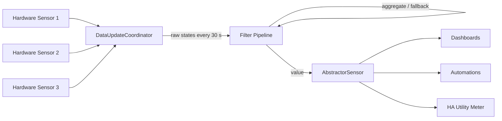

# AbstrHActor

The `abstractor` custom integration creates stable, hardware-independent
power, energy, and water sensors from one or more existing Home Assistant
entities. Configure it through **Settings > Devices & services**; options can
be changed without editing YAML.

Power sources fail soft to `0 W` when unavailable. Energy and water sources
fail closed to `unavailable`, and optional monotonic filtering rejects counter
drops. Multiple sources are summed, with optional inversion and fallback
behavior per config entry. Existing HA Utility Meter entities remain the
recommended consumer of abstracted energy sensors.

The integration persists a versioned support snapshot in HA storage and exposes
`abstractor.export_data` and `abstractor.import_data`. Import validates and
stores that snapshot but deliberately does not recreate config entries
automatically. Home Assistant does not provide a safe public API for recreating
an entry while preserving its registry identity and recorder history.

## Features

- **Hardware abstraction** — automations, dashboards, and utility meters only
  ever see the abstract sensor, never the physical device.
- **Aggregation** — sum multiple source entities into one abstract sensor
  (e.g. several sockets of a power strip).
- **Spike filter** — monotonic guard rejects counter drops below the last valid
  value, protecting long-term statistics.
- **Inversion** — multiply values by `-1` to model net flows (load minus
  feed-in).
- **Fallback to zero** — report `0` instead of `unavailable` when no source
  delivers a value (configurable).
- **Config Flow + Options Flow** — add and reconfigure devices purely through
  the UI, with stable unique IDs.
- **Export / Import services** — versioned snapshot of all mappings and values
  for backup and restore.
- **Diagnostics** — native HA diagnostics for support and debugging.
- **Device registry integration** — each abstract sensor appears as its own
  logical device in the HA device registry (device name is configurable at
  setup; clustering multiple abstract sensors under one shared device, and
  customizing manufacturer/model, is not implemented yet — tracked as a
  follow-up).

## Architecture

The integration follows a simple, testable pipeline:



### Data flow

1. **`AbstractorDataUpdateCoordinator`** — a single shared
   `DataUpdateCoordinator` polls all configured source entities every 30
   seconds. One poll serves every config entry, so there are no N parallel
   polls.
2. **`AbstractorFilterPipeline`** — one pipeline per config entry processes the
   raw source states: non-numeric/unavailable handling, optional inversion,
   monotonic spike guard, aggregation (sum), and fallback logic. Power sources
   fail soft to `0`; energy and water fail closed to `unavailable` so a utility
   meter never counts a bad sample.
3. **`AbstractorSensor`** — a `CoordinatorEntity` exposes the pipeline result as
   a native HA sensor with the correct `device_class`, `state_class`, and
   `unit_of_measurement`, grouped into a logical device via `device_info`.

### Sensor mapping

| Device type | Entity class | Unit | State class | Source behavior |
|---|---|---|---|---|
| `power` | `sensor` | `W` | `measurement` | fail soft to `0` |
| `energy` | `sensor` | `kWh` | `total_increasing` | fail closed to `unavailable` |
| `water` | `sensor` | `L` | `total_increasing` | fail closed to `unavailable` |

## Quick start

### 1. Install

**Via HACS** (recommended): add this repository as a custom repository
(`https://github.com/Popoboxxo/AbstrHActor`, category *Integration*) and
install *Abstractor*.

**Manual install:** copy the `custom_components/abstractor/` folder into your
HA `config/custom_components/` directory, then restart Home Assistant.

### 2. Add a device (Config Flow)

1. Go to **Settings > Devices & services > Add Integration**.
2. Search for **Abstractor** and start the flow.
3. Choose a **Device Type** (`power`, `energy`, or `water`).
4. Select **one** source entity, **or** select **multiple** source entities to
   create a summed (aggregated) sensor. At least one source is required.
5. Submit — the entry is created with a stable unique ID based on the device
   type and source entities. A new sensor entity appears immediately.

### 3. Reconfigure hardware (Options Flow)

To swap a broken device without touching your automations: open the Abstractor
entry under **Devices & services > Abstractor > Options**, replace the source
entities, and save. The abstract sensor's `entity_id` and `unique_id` stay
stable — dashboards, automations, and utility meters keep working.

## Configuration reference

### Config Flow fields

| Field | Type | Default | Description |
|---|---|---|---|
| `device_type` | select (`power` / `energy` / `water`) | required | The kind of abstract sensor to create. |
| `source_entity_id` | entity selector | optional | Single hardware sensor to abstract. |
| `source_entity_ids` | entity selector (multi) | optional | One or more entities to sum. Use this instead of the single-source field for aggregation. |

At least one of `source_entity_id` / `source_entity_ids` must be provided,
otherwise the flow shows a `source_required` error.

### Options Flow fields

| Field | Type | Default | Description |
|---|---|---|---|
| `source_entity_ids` | entity selector (multi, required) | current sources | Replace or extend the hardware entities feeding this abstract sensor. |
| `spike_filter` | boolean | `false` | Reject drops below the last valid value (recommended for energy and water counters). |
| `invert` | boolean | `false` | Multiply the value by `-1` (e.g. net flow: load minus feed-in). |
| `fallback_zero` | boolean | `false` | Report `0` instead of `unavailable` when no source delivers a value. |

Options are applied without a restart: the config entry is reloaded
automatically when you save.

### Services

| Service | Description |
|---|---|
| `abstractor.export_data` | Persist and log a complete snapshot of all abstract sensor mappings and values. |
| `abstractor.import_data` | Validate and store a previously exported snapshot. Does **not** recreate or modify config entries. |

Exports use `format: abstractor.snapshot`, `version: 1`, and contain the
portable `data` / `options` of every entry plus the latest abstracted values.
Import validates the snapshot shape and stores it in HA `.storage/` for review
and restore.

## Docker test infrastructure

The repository ships a reproducible, disposable test stack — no running Home
Assistant instance is required. `pytest-homeassistant-custom-component`
provides the `hass` / `enable_custom_integrations` fixtures fully in-process.

### Files

| File | Purpose |
|---|---|
| `Dockerfile.test` | Test image: Python 3.12 slim + pinned Home Assistant + pytest, ruff, mypy. |
| `docker-compose.test.yml` | `test` service (pytest, default profile) and `lint` service (ruff + mypy, profile `lint`). |
| `scripts/run_tests.sh` / `scripts/run_tests.ps1` | One-shot runner for Linux/macOS and Windows. |

### Run the tests

```bash
# Build the image
docker compose -f docker-compose.test.yml build

# Run the full pytest suite with coverage
docker compose -f docker-compose.test.yml run --rm test
```

Coverage reports (including `coverage.xml`) are written to `./test-results`.

### Focused runs and overrides

```bash
# Pass extra pytest args on the CLI
docker compose -f docker-compose.test.yml run --rm test -k test_filters

# Override the whole pytest invocation via PYTEST_ARGS
PYTEST_ARGS="tests/test_snapshot.py -v" docker compose -f docker-compose.test.yml run --rm test

# Pin a different Home Assistant version at build time
docker compose -f docker-compose.test.yml build --build-arg HOMEASSISTANT_VERSION=2025.4.1
```

### Static checks (ruff + mypy)

```bash
docker compose -f docker-compose.test.yml --profile lint run --rm lint
```

### One-shot runner scripts

```bash
# Linux / macOS
./scripts/run_tests.sh                 # build + pytest + lint
./scripts/run_tests.sh --lint-only     # build + lint only
./scripts/run_tests.sh -- -k test_filters

# Windows (PowerShell)
.\scripts\run_tests.ps1
.\scripts\run_tests.ps1 -LintOnly
.\scripts\run_tests.ps1 -TestArgs "-k test_filters"
```

## Known limitations

- **No automatic YAML migration.** Existing YAML entities are not
  automatically imported. A custom integration cannot safely claim an existing
  YAML entity's registry identity or history without explicit,
  installation-specific registry migration. Configure new entries with the
  intended stable IDs and migrate consumers deliberately.
- **No native Utility Meter replacement.** Existing HA Utility Meter entities
  remain the supported consumer of abstracted energy sensors. The integration
  does not yet provide its own long-term statistics (daily/monthly/yearly
  totals) — feed the abstract energy sensor into a native Utility Meter.
- **Import does not recreate entries.** `abstractor.import_data` validates and
  stores a snapshot but deliberately does not create `ConfigEntry` objects:
  preserving registry identity and recorder history is not exposed as a safe
  public migration API. Recreate entries through the Config Flow.
- **No conditional cross-entity fallback.** Conditional fallback expressions
  (e.g. "use sensor B only while charger C is idle") are not modeled yet;
  inversion and per-entry fallback behavior are supported.
- **InfluxDB push is scaffolded only.** The `InfluxExporter` class exists for
  the optional telemetry push, but it is not yet wired into the Config Flow or
  activated in the coordinator.

## Requirements

The full requirements specification (`docs/REQUIREMENTS.md`) covers core
features (REQ-CORE), failure compensation (REQ-COMP), utility meter
integration (REQ-UTIL), sensor types (REQ-SENS), non-functional requirements
(REQ-NFA), and data management (REQ-DATA).

See `docs/REQUIREMENTS_COVERAGE.md` for the full FA/NFA audit of what is
implemented, delegated to Home Assistant, or out of scope.
