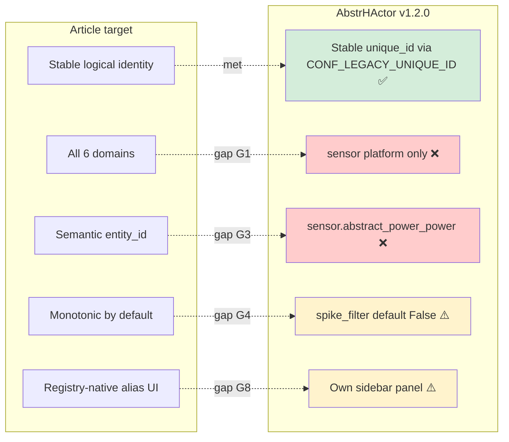
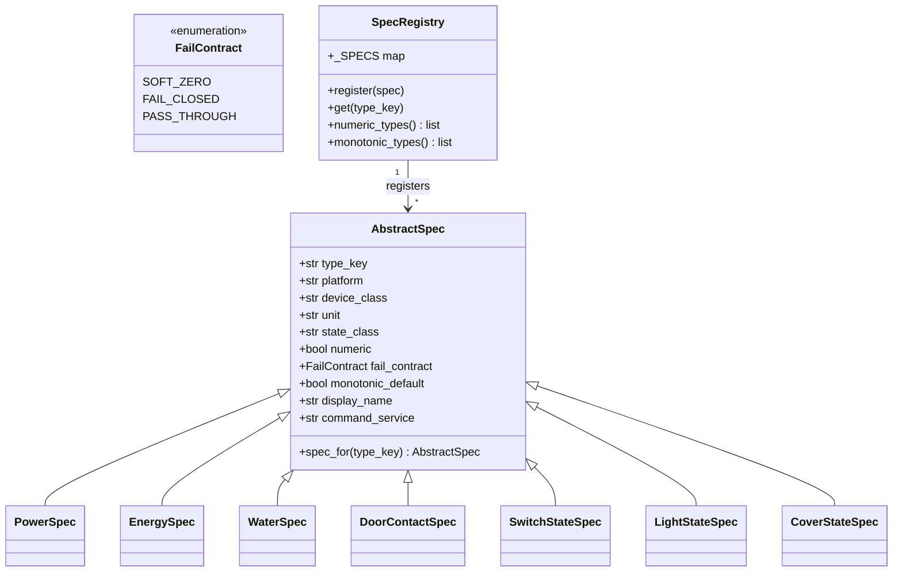
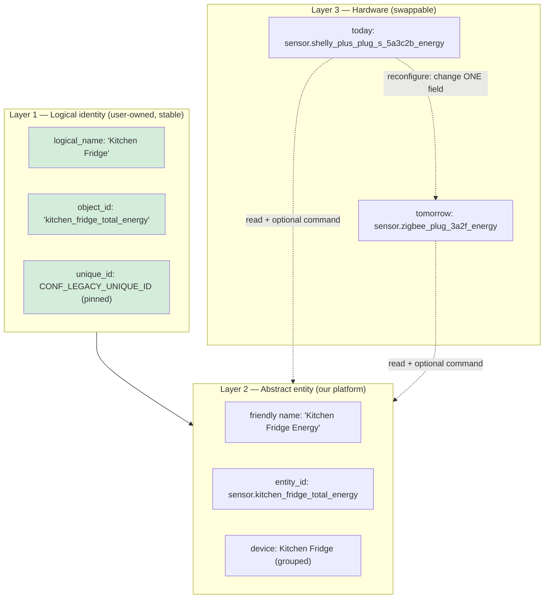
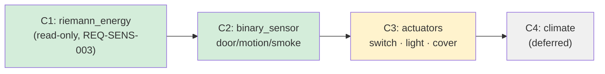
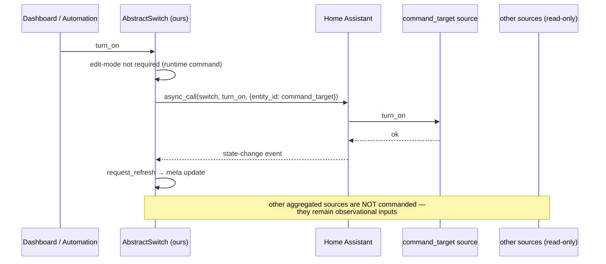
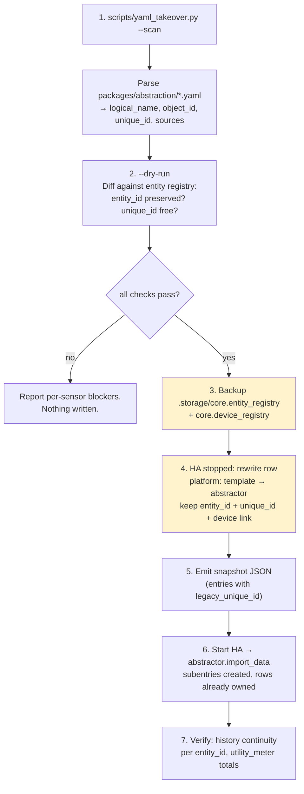
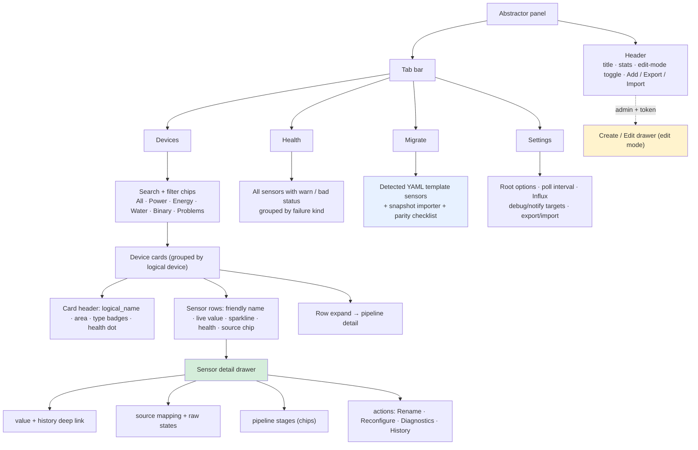
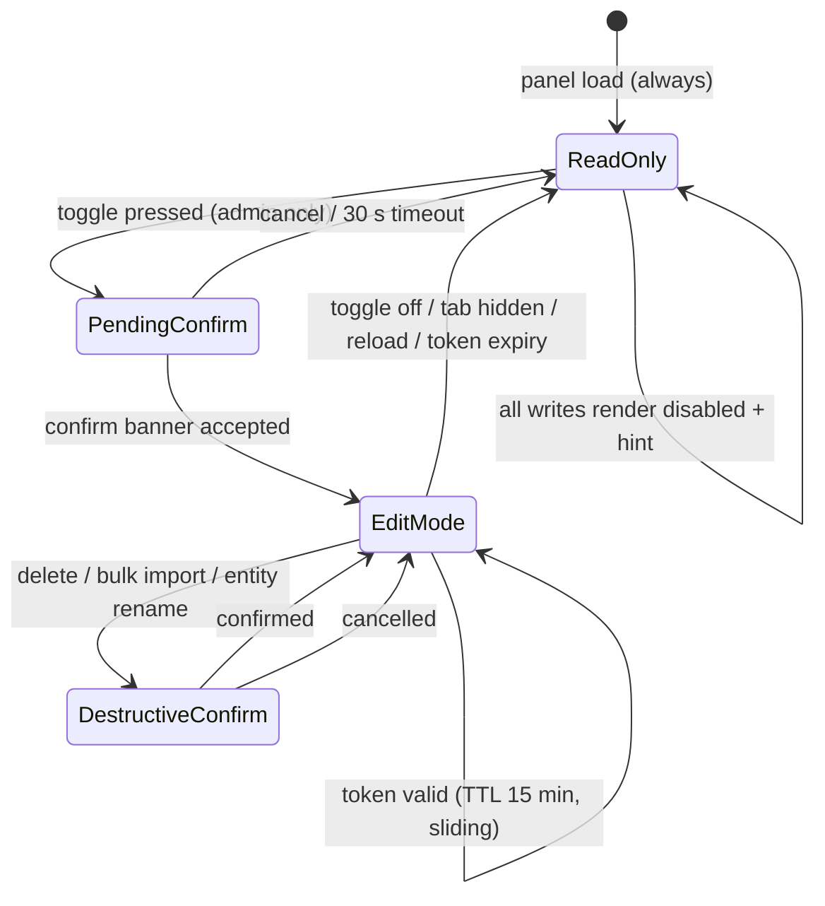
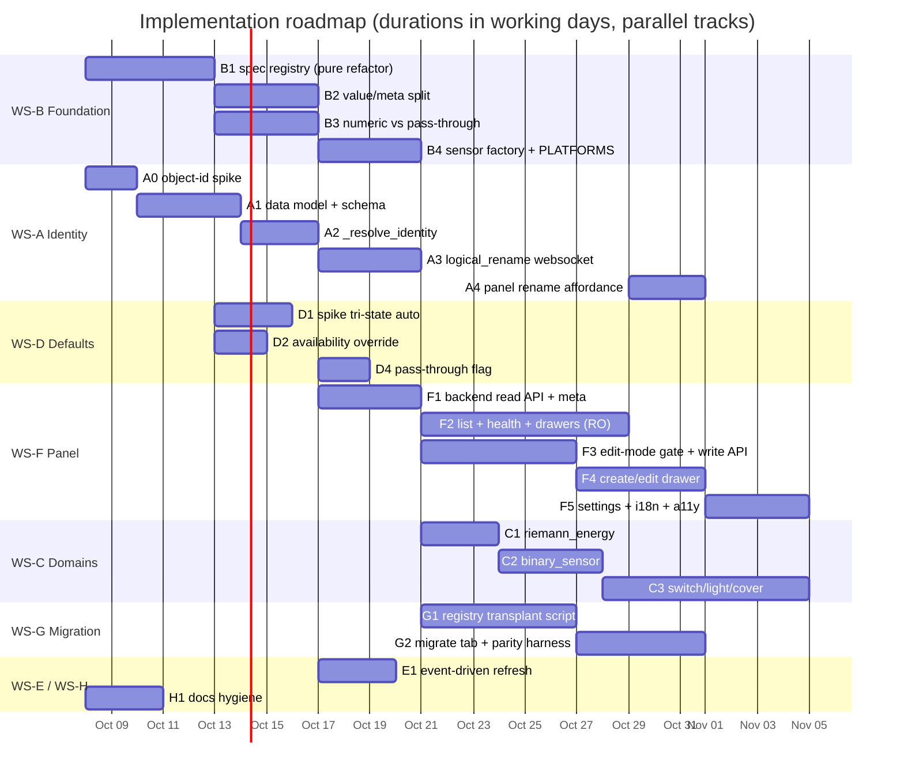

# Plan: Native-Grade Entity Aliasing — Logical Identity, Domain Expansion & Panel UX

**Status:** proposed
**Date:** 2026-10-07
**Scope:** `custom_components/abstractor/` (backend + sidebar panel), `scripts/`, `docs/`
**Builds on:** `docs/plan-full-abstraction-and-panel-ui.md` (Phase A — `.local` migration + panel P1/P2),
`docs/device-mapping-ui-design.md` (done), `docs/plan-panel-action-hub.md` (done)
**Motivated by:** [HA Discussions #3402 — Native Entity Aliasing](https://github.com/orgs/home-assistant/discussions/3402)

---

## 1. Why now — goal delta against Discussion #3402

### 1.1 What the article promises

| # | Article claim | Reference in the article |
|---|---|---|
| C1 | A **stable logical entity** sits in front of any hardware entity; the source changes, the alias stays | "The source changes. The alias stays." |
| C2 | Works **across every domain**: `light`, `climate`, `switch`, `sensor`, `binary_sensor`, `cover` | Domain table |
| C3 | **Semantic, self-documenting entity IDs** (`sensor.kitchen_fridge_total_energy`) | "The configuration becomes readable." |
| C4 | **Monotonic guard** is a native default for `total_increasing` — not a user-land hack | "`monotonic: true` … it should never need to exist in user config" |
| C5 | Hardware migration / integration rename / protocol migration **without data loss** | Use cases 1–3 |
| C6 | **Multi-device aggregation** (sum/average) behind one logical entity | Use case 7 |
| C7 | Utility-meter / Energy-Dashboard consumers keep working untouched | Proof-of-concept YAML |
| C8 | **"Create logical alias" directly in the Entity Registry UI** | "Or even better — directly in the Entity Registry UI" |
| C9 | Phantom-energy prevention through physical-law enforcement | "Bonus Problem" section |
| C10 | Cleaner, grouped Entity Registry reflecting the *home*, not the hardware | Use case 8 |

### 1.2 Where we stand today



**Verdict: ~60 % of the article's goal is met.** The *identity* half (C1, C5, C6, C7, C9) is
implemented and hardened; the *breadth* half (C2, C3, C4, C8, C10) is not.

### 1.3 Gap register

Priorities: **P0** blocks the article's headline claim · **P1** needed for correctness/completeness ·
**P2** quality · **P3** hygiene.

| ID | Gap | Article ref | Priority | Owner workstream |
|---|---|---|---|---|
| G1 | Only `PLATFORMS = ["sensor"]` (`__init__.py:54`); no `light`/`climate`/`switch`/`binary_sensor`/`cover` | C2 | **P0** | WS-C |
| G2 | Pipeline/coordinator are `float`-only — structurally blocks G1 | C2 | **P0** | WS-B |
| G3 | No per-device logical name; entity_id resolves to `sensor.abstract_power_power` (`tests/test_services.py:184`) | C3 | **P0** | WS-A |
| G4 | `spike_filter` defaults to `False`, also for `TOTAL_INCREASING` counters | C4/C9 | **P1** | WS-D |
| G5 | Energy/water `None` renders as `unknown`, not `unavailable` (no `available` override) — FA-07 not literally met | C7 | **P1** | WS-D |
| G6 | YAML base (130 `unique_id`s) cannot be taken over — FA-02/FA-09 open | C5 | **P1** | WS-G |
| G7 | 30 s polling vs. event-driven templates → visible latency | C1 | **P2** | WS-E |
| G8 | Panel is a read-only card list; no health, no naming, no bulk ops | C8/C10 | **P2** | WS-F |
| G9 | REQ-UTIL-001 (built-in stats), REQ-SENS-003 (Riemann), REQ-COMP-005 (pass-through toggle) unimplemented | — | **P2** | WS-D/WS-B |
| G10 | Stale docs: README limitations (GH#18, conditional fallback), `REQUIREMENTS_COVERAGE` FA-12, `AUDIT_UI_CONFIG` §4(b), `frontend.py` ADR-007 header | — | **P3** | WS-H |

---

## 2. Goals / Non-goals

### Goals

- **G-A** A user can give every Abstract sensor a *logical name* and a *semantic entity_id* once, and never
  think about hardware again (C3).
- **G-B** The integration's type system grows from 3 numeric sensor types to a declarative spec registry
  covering read-only states first, actuators second (C2).
- **G-C** Monotonic protection and correct availability become *defaults*, not expert settings (C4/C7/C9).
- **G-D** The sidebar panel becomes the place where the abstraction is **observed and trusted**: health,
  pipeline state, identity, and — behind an explicit edit gate — managed (C8/C10).
- **G-E** The existing YAML base can be taken over with recorder history intact (C5), closing FA-02/FA-09.

### Non-goals

- Becoming HA Core. `alias:` YAML syntax and an Entity-Registry "Create logical alias" button are
  core-only; we approximate them (§5.4 screen 5) and keep the core request open.
- `climate` in the first two phases (C2 table row) — see WS-C, phase C4.
- Replacing native `utility_meter` (REQ-UTIL-002 stays the supported consumer).
- Changing the snapshot export format (see §3.5 for the constraint this imposes).

---

## 3. Target architecture

### 3.1 Keystone: a declarative entity spec registry

Today `CONF_DEVICE_TYPE` conflates *domain*, *measurement kind* and *failure contract*, hard-coded as
`if/elif` in `sensor.py:136-148` and as `device_type == "power"` checks in `filters.py`. Every new domain
would add another branch in three files.

Replace it with one declarative table — matching the project convention *"Sensor types as
EntityDescription dataclass lists (declarative, no boilerplate)"*:



`custom_components/abstractor/specs.py` (new, HA-free, unit-testable → serves REQ-NFA-002):

| `type_key` | platform | numeric | fail contract | monotonic default | phase |
|---|---|---|---|---|---|
| `power` | sensor | yes | SOFT_ZERO | no | existing |
| `energy` | sensor | yes | FAIL_CLOSED | **yes** | existing |
| `water` | sensor | yes | FAIL_CLOSED | **yes** | existing |
| `riemann_energy` | sensor | yes | FAIL_CLOSED | **yes** | C1 (REQ-SENS-003) |
| `door_contact`, `motion`, `smoke`, … | binary_sensor | no | PASS_THROUGH | no | C2 |
| `switch_state` | switch | no | PASS_THROUGH | no | C3 |
| `light_state` | light | no | PASS_THROUGH | no | C3 |
| `cover_position` | cover | yes | PASS_THROUGH | no | C3 |
| `climate_zone` | climate | mixed | PASS_THROUGH | no | C4 (deferred) |

`platform` is **derived, never user-set** — it keeps the subentry schema stable while the type list grows.

### 3.2 Data flow: today vs. target

```mermaid
flowchart TB
    subgraph TODAY["Today (v1.2.0)"]
        direction LR
        S1["source entities"] -->|poll every 30 s| CO1["coordinator"]
        CO1 --> P1["FilterPipeline → float | None"]
        P1 --> D1["coordinator.data[id] : float"]
        D1 --> E1["AbstractorSensor"]
        E1 --> C1["utility_meter / dashboards"]
    end

    subgraph TARGET["Target"]
        direction LR
        S2["source entities"] -->|state-change listener + poll| CO2["coordinator"]
        S2 -.->|actuator commands| CMD["service fan-out → command_target"]
        CO2 --> P2["FilterPipeline → PipelineResult"]
        P2 --> DV["coordinator.data[id] : value  (unchanged shape)"]
        P2 --> MV["coordinator.meta[id] : health + events  (NEW)"]
        DV --> E2["AbstractSensor (per spec platform)"]
        MV --> E2
        MV --> PN["sidebar panel health views"]
        E2 --> C2["utility_meter / dashboards / automations"]
    end

    style MV fill:#d4edda
    style CMD fill:#d4edda
```



### 3.3 The `value` / `meta` split (design decision)

`coordinator.data` **keeps its current shape** (`dict[str, value]`). Diagnostics go into a *parallel*
`coordinator.meta` dict.

*Why not the `{value, meta}` envelope proposed in `plan-full-abstraction-and-panel-ui.md` §4.2:*
that envelope would break (a) the snapshot `values` map, which is round-tripped and compared verbatim
(`tests/test_services.py:124`), (b) the spike-filter reseed path
(`initial_last_valid_state=stored_values.get(subentry_id)`, `__init__.py`), and (c) every
`coordinator.data[id] == 10.0` assertion (`tests/test_lifecycle.py:117`). The parallel dict adds a
second surface with zero migration cost.

```python
# coordinator.py (new)
self.meta: dict[str, SubentryMeta] = {}

@dataclass(frozen=True, slots=True)
class SubentryMeta:
    last_event: str | None          # "spike rejected" | "fallback source used" | ...
    event_at: datetime | None
    spike_rejections: int           # monotonic guard hits since setup
    fallbacks: int
    unavailable_samples: int
    source_states: dict[str, str]   # per-source raw state, redacted in diagnostics
    stale: bool                     # source silent longer than 2x poll interval
```

`native_value` and the snapshot stay byte-identical; the panel reads `meta` over websocket.

### 3.4 Logical identity model

Three layers, exactly as the article frames them:



**Resolution rules** (implemented in `sensor.py`, single function `_resolve_identity`):

1. **Device name** = subentry `logical_name` if set → else root option `device_name` template (today's
   behavior, zero change for existing installs).
2. **Entity name** = `spec.display_name` (`"Power"`, `"Energy"`, `"Door"`, …) under `has_entity_name = True`
   → friendly name `"Kitchen Fridge Energy"`.
3. **Object id** = subentry `object_id` if set → `self.entity_id = f"{platform}.{object_id}"` in
   `__init__` → HA honors it on first creation (`entity_platform._async_add_entity_impl`: *"An entity may
   suggest the entity_id by setting entity_id itself"*, verified against the installed HA). On later
   starts the registry row wins, so the suggestion can never rename an existing entity.
4. **unique_id** = `CONF_LEGACY_UNIQUE_ID` (unchanged, always wins) → else source-derived (unchanged).

**Compatibility:** `logical_name` and `object_id` are *absent* on every existing subentry → rules 1 and 3
fall through to exactly today's behavior. No migration step, no entity churn.

**Grouped devices:** `logical_name` is a *device* property but must live in subentry data (the only
persisted, snapshotted, exportable store). Rule: all subentries sharing a `device_group_id` carry the
same `logical_name`; `_normalize_subentry_data` copies it from the group leader when a sensor joins a
group, and the rename command (§5.6) writes it to every member in one transaction.

### 3.5 Data model changes

| Key | Where | Type | Default | Backward compat |
|---|---|---|---|---|
| `logical_name` | subentry | str (1–64) | *absent* → root template | new, opt-in |
| `object_id` | subentry | slug `^[a-z0-9_]+$` | *absent* → HA-derived | new, opt-in |
| `spike_filter` | subentry | `true` \| `false` \| *absent* | *absent* = **auto** | `false` keeps meaning "explicit off" |
| `command_target_entity_id` | subentry | entity id | *absent* → first source | new (C3 only) |
| `source_group_pattern` | subentry | glob/regex | *absent* | new (B1, Phase A) |
| `unit_of_measurement`, `unit_factor` | subentry | str, float | spec default | new (B3, Phase A) |
| `spike_filter_mode` | subentry | `monotonic`\|`band` | `monotonic` | new (B4, Phase A) |
| `coordinator.meta` | runtime | `dict[str, SubentryMeta]` | n/a | not persisted |

**Snapshot format is untouched** (`values` stays a plain value map; `data` gains two optional keys,
which `validate_snapshot` must tolerate — additive, version stays `1`).

---

## 4. Workstreams

### WS-A — Logical identity & semantic entity IDs (closes G3)

| Step | Content | Size |
|---|---|---|
| **A0** | **Spike:** confirm the `entity_id` suggestion path on the pinned HA floor *and* on the next version (it carries a `breaks_in_ha_version="2027.2.0"` report on the invalid-id branch only — valid ids are unaffected). Write `tests/test_sensor.py::test_object_id_suggestion`. | S |
| **A1** | Add `logical_name` + `object_id` to `_schema()`, `_normalize_subentry_data`, snapshot validate, strings/translations. Group-leader propagation in `_normalize`. | M |
| **A2** | `_resolve_identity()` in `sensor.py`; `DeviceInfo(name=...)` from `logical_name`; `self.entity_id` suggestion from `object_id`. | S |
| **A3** | `abstractor/logical_rename` websocket: updates `logical_name` across a device group, optionally performs an entity-registry rename (`async_update_entity(..., new_entity_id=...)`) with collision check. Edit-mode gated (§5.3). | M |
| **A4** | Panel: rename affordance (§5.4 screen 5); entity_id shown as the *primary* identifier, not the technical suffix. | S |

**Acceptance:** create a sensor with `logical_name = "Kitchen Fridge"`,
`object_id = "kitchen_fridge_total_energy"` → `sensor.kitchen_fridge_total_energy`, friendly
`Kitchen Fridge Energy`, device `Kitchen Fridge`; reconfigure the source to different hardware →
`entity_id`, `unique_id`, recorder history all unchanged.

### WS-B — Spec registry + state/meta split (closes G2, enables G1)

| Step | Content | Size |
|---|---|---|
| **B1** | `specs.py` with `AbstractSpec` + `SpecRegistry`; move the `if/elif` block out of `sensor.py` and the `device_type == "power"` branches out of `filters.py` into spec lookups. Existing three types re-expressed as specs. **Pure refactor — no behavior change, full suite must stay green.** | M |
| **B2** | `PipelineResult` internal type (`value: float | str | bool | None`, `state_class`, `attributes`); `coordinator.data` still receives only `.value`; `coordinator.meta` receives the rest. | M |
| **B3** | Numeric vs. pass-through branches: `spec.numeric` gates float parsing, spike guard and fail contracts; non-numeric specs pass the raw state through with `PASS_THROUGH`. | M |
| **B4** | `AbstractSensor` → factory that returns `AbstractorSensor` (numeric) or `AbstractorStateSensor` (binary/switch/light/cover state) sharing one base class; `PLATFORMS` built from the registry. | M |

**Acceptance:** `PLATFORMS` derives from specs; `tests/test_filters.py` + `test_sensor.py` unchanged in
expectations; a new spec can be added with **zero** changes outside `specs.py`.

### WS-C — Domain expansion (closes G1)



- **C1 — `riemann_energy`** (S): integrates a `power` source with the trapezoidal rule inside the
  pipeline (resets on source counter reset / negative jump). Closes REQ-SENS-003 and removes the last
  reason to keep a YAML `integration` sensor.
- **C2 — read-only binary states** (M): `binary_sensor` platform, `on`/`off` mapping, no spike guard,
  availability = source present. Delivers `binary_sensor.front_door` from the article's table.
- **C3 — actuators** (L): read state *and* forward commands.



  Design decisions:
  - `command_target_entity_id` defaults to the **first configured source**; an aggregate (sum of 4
    plugs) commands exactly one, so `turn_on` is never ambiguous.
  - A sourceless/actuator-less spec renders a **read-only entity** rather than failing — state
    observation is still valuable.
  - Commands are *runtime* actions, not configuration: **not** gated behind edit mode.
- **C4 — `climate`** (deferred): needs attribute passthrough (`current_temperature`, `hvac_action`),
  a mode-enum mapping and `set_temperature` fan-out. Tracked, not scheduled.

### WS-D — Compensation defaults (closes G4, G5, part of G9)

| Step | Content |
|---|---|
| **D1** | `spike_filter` becomes **tri-state**: form renders `auto (recommended) / on / off`; *absent* means auto. Auto = `spec.monotonic_default` → `True` for `energy`, `water`, `riemann_energy`; `False` for `power`. Existing persisted `true`/`false` values keep their literal meaning → zero behavior change for configured sensors, **safer default for new ones** (article C4). |
| **D2** | Override `available` on the numeric sensor: `coordinator.last_update_success and self.native_value is not None`. Energy/water with no parseable sample → **`unavailable`** (FA-07 literal), power never fails (SOFT_ZERO). |
| **D3** | REQ-UTIL-001 — expose long-term statistics on the abstract energy sensor via `total_increasing` + a native `statistics` metadata check (verify against `sensor` state-class rules before committing; if HA already derives it, this step collapses to a test). |
| **D4** | REQ-COMP-005 — explicit `pipeline_enabled` (default `True`); when `False` the pipeline is a literal pass-through including state/availability, for source entities that already do their own filtering. |

### WS-E — Latency (closes G7)

- Register `async_track_state_change_event` on the union of all configured source entity ids.
- Debounced `coordinator.async_request_refresh()` (500 ms trailing debounce, hard cap 1 refresh/s).
- Rebuild the listener set on every subentry add/remove/reconfigure (hook into the existing update
  listener) — same place the coordinator pruning already happens (`__init__.py`).
- Polling stays as the safety net (a missed event must never strand a sensor).
- Result: template-parity responsiveness without giving up the single-coordinator architecture.

### WS-F — Panel UX (closes G8) — detailed in §5

### WS-G — YAML takeover assistant (closes G6)

The article's headline use case (C5) only pays off for sensors the integration already owns. The 130
existing template `unique_id`s live under platform `template`; `entity_registry.async_update_entity`
cannot change `platform` or `unique_id`, which is why FA-09 is currently marked *unsupported by API*.

**Recommended path — offline registry transplant:**



Why this preserves history: recorder `states` and `statistics` are keyed by **`entity_id`**, not by
`unique_id`. Editing the registry row in place keeps the `entity_id` string, so both the state history
and the long-term statistics series continue unbroken; the `unique_id` stays the same so nothing else
re-keys either. The transplant is the *only* step that touches `.storage` and must be explicit,
backup-gated and version-checked (HA may reformat the file between releases).

Fallback for anyone who does not accept `.storage` surgery: **WS-A already delivers the article's
promise for all newly created sensors**; the YAML base is migrated by *recreating* the abstract sensor
and re-pointing consumers — history for those specific entities restarts. That trade-off must be a
user decision, surfaced in the panel's migration tab, never automatic.

### WS-H — Documentation hygiene (closes G10)

| File | Fix |
|---|---|
| `README.md` "Known limitations" | Device bundling **is** implemented (REQ-CORE-008, GH#18 overstated) → remove or restate. |
| `README.md` "Known limitations" | "No conditional cross-entity fallback" → `fallback_condition_entity_id/state` exist; restate as "no free-form expression". |
| `README.md` config reference | Tables omit `aggregation`, `net_subtract_entity_id`, `fallback_*`, device-mapping fields; fields are also mis-labelled Config vs Options Flow. Rebuild from `_schema()`. |
| `docs/REQUIREMENTS_COVERAGE.md` FA-12 | Same conditional-fallback correction. |
| `docs/AUDIT_UI_CONFIG.md` §4(b) | `target_device_id`/`create_new_device` are back in the form → add resolution note. |
| `custom_components/abstractor/frontend.py` docstring | Still cites ADR-007 as read-only; §4.1 of the Phase A plan supersedes it. Update with this plan's §5.3. |

---

## 5. Panel UX concept

### 5.1 Principles

1. **Observe before configure.** Read-only is the default and shows *why* a value is what it is —
   the article's whole point is trust in the abstraction, which YAML never made visible.
2. **Identity is the hero.** The logical name and semantic `entity_id` lead every row; hardware
   entity ids are secondary, collapsed detail.
3. **Problems surface themselves.** Spike rejections, fallback activation and stale sources are
   first-class visual states, not log lines.
4. **Edits are deliberate.** Write mode is opt-in, admin-only, session-local and server-verified
   (§5.3) — the safety intent of ADR-007 without its scaling limitation.
5. **One source of truth.** The panel calls the same normalization/validation helpers as the config
   flow; it never reimplements validation.
6. **Vanilla, dependency-free, no build step** — existing constraint of `www/abstractor-panel.js`.

### 5.2 Information architecture



### 5.3 Edit-mode gate

Carries forward the decision recorded in `plan-full-abstraction-and-panel-ui.md` §4.1
(ADR-007 abandoned, 2026-10-02).



```mermaid
sequenceDiagram
    participant P as Panel (browser)
    participant B as Backend (websocket)
    participant HA as HA core

    P->>B: abstractor/mode/token {ttl: 900}
    B->>HA: hass.user.is_admin ? (from WS context)
    alt not admin
        B-->>P: error not_allowed
    else admin
        B-->>P: {token, expires_at, session_id}
    end
    P->>P: show confirm banner, enable write UI
    loop each write command
        P->>B: abstractor/subentry/update {…, token}
        B->>B: verify admin AND token not expired AND not revoked
        alt invalid
            B-->>P: error token_invalid → panel drops to ReadOnly
        else valid
            B->>B: shared normalize/validate helper (config-flow path)
            B-->>P: ok + updated snapshot
        end
    end
    Note over B: tokens live in a server-side dict keyed by<br/>WS session; TTL enforced on every write; never client-trusted
```

**Rules:** non-admins never see the toggle · token is server-issued and short-lived (a client-side
toggle alone would be cosmetic) · destructive actions need a second inline confirmation regardless of
mode · the native config flow remains fully supported and untouched.

### 5.4 Screen inventory & wireframes

**Screen 1 — Devices tab (default, read-only)**

```
┌──────────────────────────────────────────────────────────────────────────────┐
│ Abstractor                                    [🔒 Read-only] [Edit mode]     │
│ 12 devices · 27 sensors · 2 need attention · last poll 4 s ago                │
│                                    [ + Add sensor ] [ Export ] [ Import ]     │
├──────────────────────────────────────────────────────────────────────────────┤
│ [🔍 search……………]  ( All )( Power )( Energy )( Water )( Binary )( ⚠ Problems )│
├──────────────────────────────────────────────────────────────────────────────┤
│ ⚠ Kitchen Fridge                          badges: energy · power      ● bad  │
│   manufacturer · model                              [ History ] [ ⋯ ]         │
│  ┌─────────────────────────────────────────────────────────────────────────┐ │
│  │ Total Energy   sensor.kitchen_fridge_total_energy   412.7 kWh  ▁▂▃▅▆▇  │ │
│  │ Current Power  sensor.kitchen_fridge_current_power      48 W   ▂▃▂▂▃▂  │ │
│  └─────────────────────────────────────────────────────────────────────────┘ │
│                                                                              │
│ Living Room Blinds              badges: cover                    ● ok       │
│  ┌─────────────────────────────────────────────────────────────────────────┐ │
│  │ Position       cover.living_room_blinds                      70 %  ▃▃▃  │ │
│  └─────────────────────────────────────────────────────────────────────────┘ │
│ ...                                                                          │
└──────────────────────────────────────────────────────────────────────────────┘
```

*Changes vs. today:* search + filter chips, health strip, per-sensor rows (today only entity_id +
value), semantic name first, technical entity_id second, health dots, sparklines, History/More actions.

**Screen 2 — Sensor row expanded (pipeline detail)**

```
│  Total Energy   sensor.kitchen_fridge_total_energy   412.7 kWh   ▁▂▃▅▆▇   ▼ │
│  ┌─────────────────────────────────────────────────────────────────────────┐ │
│  │ Source   sensor.shelly_plus_plug_s_5a3c2b_energy      412.7 kWh   ok   │ │
│  │ Pipeline [parse ✓] [invert –] [spike AUTO ✓ 0 rejects] [sum] [fallback –]│ │
│  │ Health   last event: —   ·   spike rejections 24h: 0   ·   fallbacks: 0 │ │
│  │ Identity unique_id abstractor_a1b2…  ·  device Kitchen Fridge           │ │
│  │ Actions  [Open entity] [Reconfigure] [Diagnostics] [Rename]              │ │
│  └─────────────────────────────────────────────────────────────────────────┘ │
```

**Screen 3 — Sensor detail drawer** (opened by clicking a row)

```
┌── Sensor detail ──────────────────────────────────────── [ × ] ─┐
│  Kitchen Fridge Energy                                          │
│  sensor.kitchen_fridge_total_energy                    412.7 kWh│
│  ▁▂▃▅▆▇▇▆▅▃▃▄▅▆▇▇▆▅▄▃▃▄▅▆▇        [ Open in HA ]  [ History ]    │
│                                                                  │
│  Identity                                                        │
│   logical name   Kitchen Fridge            [ Rename ]            │
│   object id      kitchen_fridge_total_energy                     │
│   unique_id      abstractor_a1b2c3d4…      (pinned, read-only)   │
│   device         Kitchen Fridge (bundled, 2 sensors)             │
│                                                                  │
│  Sources                                                        │
│   ● sensor.shelly_plus_plug_s_5a3c2b_energy      412.7 kWh       │
│   ○ (fallback) sensor.zigbee_plug_3a2f_energy    — not active    │
│                                                                  │
│  Pipeline                                                       │
│   parse → spike(auto) → sum → fail-closed → value                │
│   rejects 24h 0 · fallbacks 0 · unavailable samples 0            │
│                                                                  │
│  [ Reconfigure… ]  [ Diagnostics… ]  [ Delete… ]                  │
└──────────────────────────────────────────────────────────────────┘
```

**Screen 4 — Create / Edit drawer (edit mode only)**

```
┌── Add Abstract sensor ───────────────────── edit mode ──────────┐
│ ⚠ Changes apply immediately — there is no draft or undo.         │
├──────────────────────────────────────────────────────────────────┤
│  Logical identity                                                │
│   Device name      [ Kitchen Fridge                        ]     │
│   Entity object id [ kitchen_fridge_total_energy           ]     │
│                     ^ optional · suggested: kitchen_fridge_energy│
│   Unique id        (generated on create, pinned afterwards)      │
│                                                                  │
│  Type                                                            │
│   ( • Energy ) ( Power ) ( Water ) ( Riemann ) ( Door ) ( Light )│
│   → unit kWh · total_increasing · monotonic guard: AUTO (on)     │
│                                                                  │
│  Sources                                                         │
│   [ entity selector, multi ]   + pattern mode (B1)               │
│   aggregation ( • sum ) ( max ) ( min ) ( first available )      │
│   command target [ entity selector ]        ← actuator specs only│
│                                                                  │
│  Pipeline                                                        │
│   spike guard  ( • auto ) ( on ) ( off )        mode: monotonic  │
│   invert       [ ]     fallback to zero [ ]     pass-through [ ] │
│   net subtract [ entity ]   fallback source [ entity ]           │
│   condition    [ entity ] = [ state ]    fallback on zero [ ]    │
│                                                                  │
│  Device                                                          │
│   place on [ existing abstractor device ▾ ]  or  [ new device ]  │
│                                                                  │
│              [ Cancel ]   [ Save sensor ]                        │
└──────────────────────────────────────────────────────────────────┘
```

**Screen 5 — "Create logical alias" equivalent** (article C8, our approximation)

Two entry points, both edit-mode gated:
1. **From the drawer:** `Rename…` on a sensor or device → logical name + optional `object_id` edit,
   with a live preview `sensor.kitchen_fridge_total_energy →` and a collision check.
2. **From HA itself:** a `Rename` action in the panel's deep links, because a custom integration
   cannot inject a button into HA's own Entity Registry dialog. This is documented as the deliberate
   substitute for the core feature and keeps Discussion #3402's UI ask visible.

```
┌── Rename logical identity ─────────────────────────────────────┐
│  Device            [ Kitchen Fridge                       ]     │
│  Entity object id  [ kitchen_fridge_total_energy          ]     │
│                      preview: sensor.kitchen_fridge_total_energy│
│                      current: sensor.abstract_energy             │
│  ⚠ Renaming changes the entity_id. Automations referencing the   │
│    old id must be updated — history follows the entity.          │
│               [ Cancel ]   [ Apply rename ]                     │
└──────────────────────────────────────────────────────────────────┘
```

**Screen 6 — Migrate tab (WS-G):** scan results table (detected YAML template sensors, planned
`legacy_unique_id`, `entity_id` preserved ✅/❌), dry-run diff, "Run transplant" (only when HA is
stopped — the panel shows a stop instruction, the script does the work), parity checklist.

**Screen 7 — Settings tab:** root options (poll interval, Influx, debug/notify targets, default
device naming template) + export/import + diagnostics download, replacing today's deep links.

### 5.5 Behaviour spec

| Concern | Spec |
|---|---|
| Health dot | `ok` (fresh, no events) · `warn` (spike/fallback in last hour, or source silent > 2× poll) · `bad` (source unavailable / coordinator failing) · `idle` (no data yet) |
| Sparkline | In-panel ring buffer of last 60 samples per entity (no websocket cost); History button deep-links to HA's native history |
| Staleness | Derived from `meta.stale`; the header shows global "last poll N s ago" |
| Read-only rendering | Write controls render **disabled with a tooltip**, never hidden — discoverability without affordance |
| Filtering | Client-side over the loaded registry; `Problems` chip = any `warn`/`bad` |
| Responsive | ≥ 1024 px full table · 640–1023 px stacked rows · < 640 px cards (HA `narrow` flag already triggers re-render) |
| i18n | Replace hardcoded EN/DE strings with a key map keyed like `strings.json` (`panel.devices.title`, …); language from `hass.language` |
| Accessibility | WCAG 2.1 AA: keyboard order follows visual order, health conveyed by icon+text (not colour alone), `aria-live` on the toast/error region, focus trap in drawers, ≥ 4.5:1 contrast on badges |
| Security | Every write goes through the §5.3 token check server-side; panel never trusts its own state |
| Error surface | Inline banner under the header (existing `.action-error`), plus per-field errors on the drawer |

### 5.6 Websocket API

| Command | Auth | Purpose |
|---|---|---|
| `abstractor/subentries` | read | Full list: data + `meta` + resolved identity + health (redaction shared with `diagnostics.py`) |
| `abstractor/mode/token` | admin | Issue a short-lived edit-mode token |
| `abstractor/subentry/create` | write | Calls `_build_new_subentry_data` + `_validate_device_mapping` |
| `abstractor/subentry/update` | write | Calls `_normalize_subentry_data` + `_validate_device_mapping` |
| `abstractor/subentry/delete` | write + confirm | Thin wrapper over `delete_sensor_service` logic |
| `abstractor/logical_rename` | write + confirm | `logical_name` across a device group + optional entity-registry rename |
| `abstractor/options/update` | write | Root options (poll interval, Influx, debug targets, naming template) |
| `abstractor/yaml_scan` | read | WS-G scan result |
| `abstractor/reload` | write | Force a coordinator refresh |

All handlers live in `frontend.py` (or a new `websocket.py`) and reuse the helpers extracted from
`config_flow.py` — single source of truth, so config-flow 100 %-coverage convention still covers the
panel path indirectly, with dedicated handler tests on top.

---

## 6. Compatibility & migration

| Scenario | Guarantee |
|---|---|
| Existing subentry, no new keys | Identical `entity_id`, `unique_id`, device, values. Rules 1/3 fall through to today's template. |
| Existing `spike_filter: false` | Still explicitly off (literal `false` ≠ *absent*). |
| Existing `spike_filter: true` | Still on. |
| New subentry, `spike_filter` untouched | Auto → on for `energy`/`water` (intended tightening, note in changelog). |
| Snapshot export/import | Additive keys only; `values` map shape unchanged; version stays `1`. |
| Config entry version | Bump only if a stored key changes meaning — none do; no `async_migrate_entry` step needed. |
| HA version floor | `manifest.json` floor unchanged; `entity_id` suggestion verified in A0 against floor and current. |

---

## 7. Test plan

| Layer | Coverage |
|---|---|
| `specs.py` | Table-driven: every spec's platform/unit/fail contract/monotonic default; unknown `type_key` fails closed |
| `filters.py` | Existing suite stays green (pure refactor B1); new cases for pass-through (non-numeric) and tri-state auto |
| `sensor.py` | A0 object-id suggestion; `logical_name` device naming; grouped-name propagation; `available` → `unavailable` for fail-closed |
| `config_flow.py` | 100 % convention: new fields validated, group-leader propagation, object-id slug validation, token-gated `_schema` variants |
| `websocket` | Admin check, token issue/verify/expiry/revoke, collision on rename, read-path redaction |
| Snapshot | Round-trip with the two new keys; `values` byte-identical to `coordinator.data` |
| `tests_e2e/` | Read-only default after fresh load → toggle → confirm → create → appears → rename (entity_id changes, history follows) → delete; Migrate tab renders scan; problem chip lights up when a source goes unavailable |
| Parity (WS-G) | Side-by-side 48 h old template vs. new abstract sensor before decommissioning YAML |

---

## 8. Sequencing



| Order | Item | Size | Rationale |
|---|---|---|---|
| 1 | H1 docs hygiene | S | Correct before anyone reads the plan |
| 2 | A0 spike | S | De-risks the P0 identity work immediately |
| 3 | B1 spec registry | M | Keystone; everything else lands on it |
| 4 | B2 + D1 + D2 | M | Meta surface + safer defaults, no UI yet |
| 5 | A1 + A2 | M | Semantic identity ships; article C3 satisfied |
| 6 | F1 + F2 | L | First visible UX win (read-only) |
| 7 | E1 | S | Latency parity with templates |
| 8 | F3 + F4 + A3 | L | Edit mode + rename = article C8 substitute |
| 9 | B3 + B4 + C1 + C2 | L | Domain breadth grows |
| 10 | G1 + G2 | L | Closes FA-02/FA-09, article C5 |
| 11 | C3 | L | Actuators |
| 12 | F5, D3, D4, D-specs | M | Polish |

S < 1 d · M 1–2 d · L 3–5 d (rough, single developer).

---

## 9. Risks & open questions

| # | Risk | Mitigation |
|---|---|---|
| R1 | `entity_id` suggestion mechanism changes (HA flags the invalid-id branch `breaks_in_ha_version="2027.2.0"`) | A0 pins behavior with a test; we only ever set *valid* ids; fall back to an explicit registry rename post-create |
| R2 | Renaming `entity_id` breaks user automations referencing the old id | Warning in the rename dialog (screen 5), never automatic, always behind the destructive-confirm step |
| R3 | Grouped `logical_name` drift (two subentries of one device disagreeing) | Single writer (`logical_rename`), propagation in `_normalize`, a consistency check in `yaml_scan`/diagnostics |
| R4 | Actuator commands to an aggregate are ambiguous | Exactly one `command_target`; documented; read-only when unset |
| R5 | Event-driven refresh causes refresh storms | 500 ms trailing debounce + 1/s hard cap; polling remains the backstop |
| R6 | `.storage` transplant breaks on a future HA registry format | Version/capability check before writing, mandatory backup, dry-run diff as the default path, script refuses to run when HA is up |
| R7 | Panel write API diverges from config-flow validation | Both call extracted shared helpers; tests pin both paths |
| R8 | Scope creep — this plan is large | Phase gates: WS-A/WS-B/WS-F read-only ship independently and each already move the article-delta forward |

**Open questions**
1. Should `object_id` be mandatory for *new* sensors (article C3 says yes) or stay optional to avoid
   surprising users with long ids? *Recommendation: required in the panel drawer, optional in the
   native config flow.*
2. Is REQ-UTIL-001 (own statistics) still wanted given native `utility_meter` works, or does D3
   (making HA's own statistics correct) make it redundant? *Recommendation: verify first, drop if redundant.*
3. Does the Migrate tab (screen 6) ship with WS-G, or earlier as a read-only scanner so users can
   *plan* their takeover while the transplant script is still in progress?

---

## 10. References

- `docs/REQUIREMENTS.md` — REQ-CORE-001…009, REQ-COMP-001…005, REQ-UTIL-001/002, REQ-SENS-001…004
- `docs/REQUIREMENTS_COVERAGE.md` — FA-02/FA-09 open (WS-G), FA-12 note stale (WS-H)
- `docs/plan-full-abstraction-and-panel-ui.md` — Phase A; §4.1 edit-mode decision carried into §5.3
- `docs/device-mapping-ui-design.md` — registry transaction + flow integration order (reused by
  `abstractor/subentry/create|update`)
- `docs/plan-panel-action-hub.md` — action hub baseline superseded by §5
- `LASTENHEFT_ABSTRAKTIONS_INTEGRATION.md` §2.1 — the original Discussion #3402 filing
- Home Assistant Discussions #3402 — *Native Entity Aliasing*
